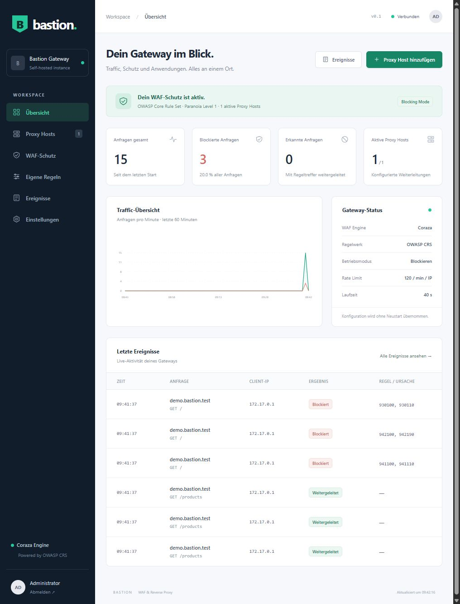

# Validation · October 9, 2026

## Executed

- `go vet ./...` – passed.
- `go test -race -count=1 ./...` – passed; nine test groups and eleven subtests.
- `node --check web/static/app.js` – passed.
- `docker compose config --quiet` – passed.
- Docker multi-stage build – passed; final `scratch` image is approximately 24 MiB.
- Final image runtime: UID/GID 10001, read-only root filesystem, and all Linux capabilities removed.
- Fresh named volume: login, configuration persistence, and authenticated Prometheus metrics passed.
- Restart with the same volume: configuration revision and settings persisted; a new login passed.
- Live proxy test: twelve legitimate requests forwarded with 200, three attacks blocked with 403; events were classified correctly.
- Browser: login, proxy host creation, custom rule creation, protection settings, event filtering, and dashboard activity with real requests were verified. No console warnings or errors appeared in the final view.

## Regression coverage

SQL injection, XSS, path traversal, JSON/form bodies, unchanged body forwarding, Detection Only mode, unknown hosts, forged forwarding headers, log redaction, custom rules, Content-Length/chunked body limits, CIDR deny/allow lists, rate limiting, path boundaries, round robin, disabled routes, configuration validation/persistence, revision conflicts, password login, CSRF, Origin checks, logout, response size limits, CRS response blocking, invalid backend TLS certificates, WebSocket handshake/tunnel, malformed JSON, compressed request bodies, absolute-form requests, and concurrent requests during configuration changes.

## Test environment and open validation

Tested on Linux/amd64 in Docker Desktop. The official Go image download was rejected with HTTP 403 in the local network environment. Go 1.26.8 was installed from the official Alpine package repository in a separate build container; the public corporate proxy CA already trusted by the Windows host was added for TLS verification. CRS packages were resolved directly from the official Git repositories after a module-proxy download failure. `go.sum` is present.

The Dockerfile was tested with `--build-arg BUILDER_IMAGE=bastionwaf-build-tools:local`; the default builder remains `golang:1.26-alpine`. The local test image therefore also contains the public corporate proxy CA. For deployment outside this environment, rebuild normally with the default builder.

Not executed: deployment in the actual LXC, external DNS/router configuration, public ACME issuance, load testing with target applications, and external penetration testing. The source build and non-root runtime image were validated locally; this does not replace target-environment validation.

The local preview at `127.0.0.1:19090` is a separate test instance. Its demo route, demo backend, preview password, and data are under the Git-ignored `.tools/` directory and are not part of the production Compose deployment. The demo backend was started only for this test process; after a manual container restart, start it again with `docker exec -d bastion-preview /preview/demo` or remove the demo route.
